# Productivity hacks

*The images in this chapter are mostly .gif files, click [here](https://docs.repl.it/tutorials/10-productivity-hacks) to access the web version of this chapter* 

After coding for a while, you may find that there are some repetitive things that take up unnecessary time. For example, searching for and updating a variable name can seem laborious. Luckily, Repl.it has some built-in productivity tools that we'll take a look at in this tutorial.

Specifically, you'll see how to:

* Make simultaneous changes in several parts of your file using multiple cursors
* Use keyboard shortcuts to quickly carry out tasks without the delay of reaching for your mouse
* Switch to Vim or Emacs keybindings for full mouseless control.

Similarly to learning to touch type, there is often a steep *learning curve* when you start to use advanced code editing features. They might even substantially slow you down at first, but once you master them you'll soar past the limits of what you could achieve without these aids.

## Using the global command palette

If you hit `Ctrl+K` (`Cmd+K` on MacOS) you'll see the following modal pop up, which lets you navigate through different parts of Repl.it at lightning speed using only your keyboard. If you have a lot of files, it's often useful to open them like this rather than scrolling through the directory structure in the files pane (the `find` option searches through files by their *name* while the `search` option searches through files by their *contents*.)


The keyboard shortcut indicated to the right of each option shows how to activate that option directly without opening up the global command palette, but once it's open you can type in a part of any of the options to activate that option. For example, in our weather project app, I can type `Cmd+K` and then type `fi` (start of `find`) and press `Enter` and then type `Lo` (start of `London.txt`) and press `Enter` again to quickly open the weather log for London.

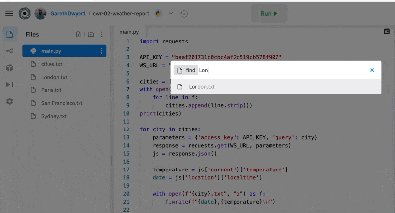

Of course, with only six files it might be faster to reach for my mouse, but as the find searches through all files in all directories this method can be significantly faster for larger projects.

Opening up the multiplayer, version control, and settings panes using this method is also faster once the habit is ingrained compared to moving the mouse to the small icons on the left bar. And while pressing `Ctrl+Enter` or `Cmd+Enter` to run your code is faster than choosing "Run" from this global command ette, `Ctrl+K` is only a single shortcut to remember and it will remind you of any other shortcuts you can't recall.

## Using the code editing command palette

The code command palette is similar to the global command palette, but it's specific to editing and navigating your code, allowing you to do advance find+replace procedures, jump to specific functions and more.

To access the code command palette press `F1` or `Ctrl+Shift+P` (`cmd+shift+P` on MacOS). Note that if you're using Firefox the second option will open an incognito window instead.

You can use the shortcuts directly from the command palette by selecting the code you wish to edit and clicking on the command in the drop-down menu, or use it to refresh your memory on the keybindings associated with the shortcuts you use often.

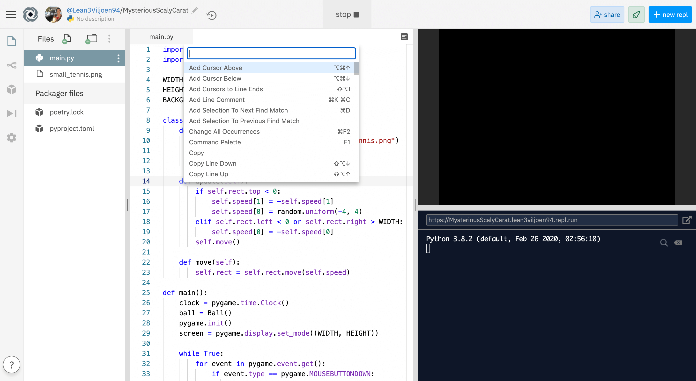

Let's take a look at how these work by editing the [PyGame juggling project](https://repl.it/@GarethDwyer1/cwr-07-juggling-with-pygame) that we covered in a [previous tutorial](http://www.codewithrepl.it/07-building-a-game-with-pygame.html).

Instead of carrying out the suggested operations as you usually would, use Repl.it's productivity features instead. 

## Duplicating entire lines

Sometimes you need two very similar lines of code directly after each other. Instead of copying and pasting the line or typing it out again, you can use the *duplicate row* feature, which will replicate the current line either above or below.

For example, our juggling project includes the following code to instantiate the initial three balls.

```python
ball1 = Ball()
ball2 = Ball()
ball3 = Ball()
```

Instead of typing out all three lines, you can type out the first one, leave your cursor position on that line, and press `Shift+Alt+down` (`shift+option+down` on MacOS) twice. This will create two copies of the line, directly below the original one, and then you can simply change the number in the variable to account for the second two balls.

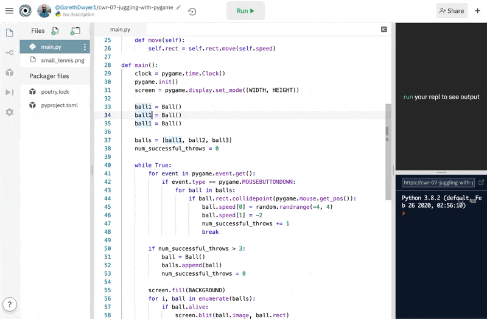

## Deleting entire lines

There may be instances where you'd want to delete large chunks of code at a time (it happens to the best of us!). 

Pressing `Ctrl+Shift+K` (`cmd+shift+K` on MacOS) deletes the line underneath your cursor (or if you have multiple lines selected it will delete all of them.)

Instead of deleting the entire line, you can also delete from your cursor up to the end of the line or from your cursor to the beginning of the line. The shortcuts for these are 

* `Ctrl+Backspace` (`cmd+backspace` on MacOS) to delete backwards
* `Ctrl+K` (same on MacOS) to delete forwards

As an example, below you can see how we might use this to first delete one of our `elif` blocks by doing two "delete line" operations. We then change our random speed to be constant by using a "delete to end of line" operation from the `=` sign and then typing our constant.

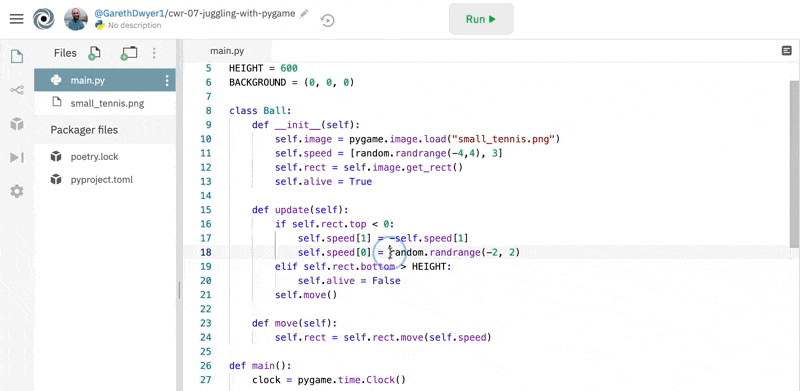

## Inserting blank lines

It's also common to need to add a new line of code above or below the current one. Instead of using your mouse or arrow keys to get to the right place and then pressing `Enter`, you can instead use an "insert line" operation.

Press `Ctrl+Shift+Enter` (`cmd+shift+enter` on MacOS) to insert a blank line directly above the current one and move the cursor to the start of it (Repl.it will even maintain the current level of indentatin for you).

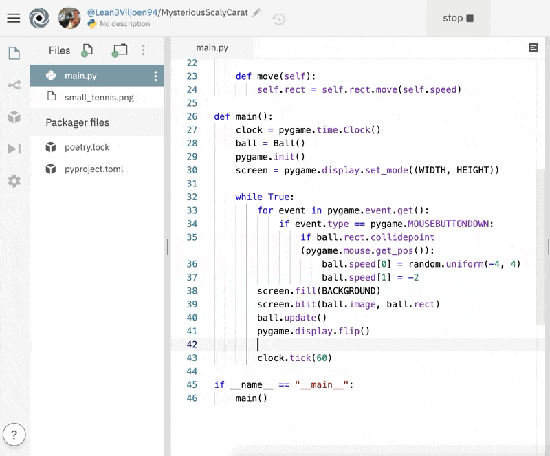

## Indenting and dedenting lines

When writing Python, you probably pay more attention to whitespace (spaces or tabs) than in other langauges, which use braces to handle logic. You're probably used to indenting and dedenting using `Tab` and `Shift+Tab`, which requires you to first place the cursor at the start of the line.

Instead you can use `Ctrl+]` (`cmd+]` on MacOS) to indent and dedent the line no matter where your cursor is. For example, if you need to fix the indentation in the following code, you can
 * put your cursor on the `for` line
 * press `Ctrl+]`
 * press `down`
 * press `Shift+down`
 * press `Ctrl+]` again twice.

Now your code's indentation will be fixed.


### Moving blocks of code within a file

Sometimes you need to move a block of code up or down in the file. For example, our `update()` function uses our `move()` function, but `move()` is only defined later. For readability, it's good to try ensure that your functions only call functions that have already been defined further up (assuming that someone else is reading the code top down, they will remember the `move()` function's definition before seeing it used).

Instead of cutting and pasting a block, you can shunt it by pressing `Alt+up` or `Alt+down` (`option+up` and `option+down` on MacOS). As with the others, this works on the line under your cursor or a larger selection.

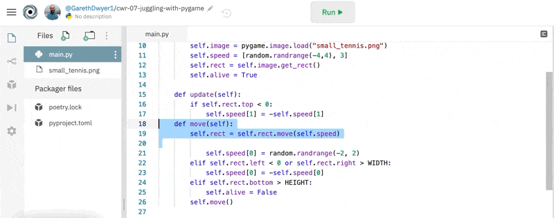

## Adding cursors

Sometimes it's useful to make exactly the same changes in multiple places at once. For example, we might want to rename our `speed` attribute to `velocity`. Put your cursor anywhere on the word that you want to change and press `Ctrl+D` (`cmd+D` on MacOS). Repeatedly press `Ctrl+D` to select matching words individually, each with their own cursor. Now you can apply edits and they will appear at each selection, as below.

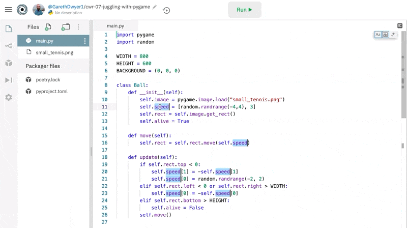

If you want multiple cursors on consecutive lines, press `Ctrl+Alt+up` or `Ctrl+Alt+down` (`cmd+option+up` and `cmd+option+down` on MacOs). For example, if we want a square game we could change both width and height to be `1000` simultaneously as follows.

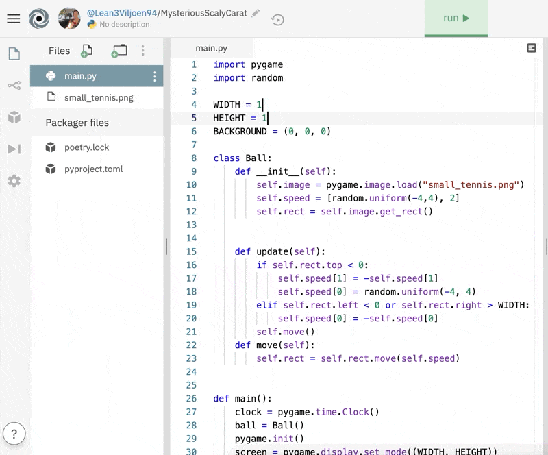

## Navigating to specific pieces of code

Sometimes, especially in larger projects, you'll call a function or instantiate an object far from where that function or object is defined (either thousands of lines away in the same file, or in a different file altogether).

If you're reading a piece of code that calls a function and you want to quickly see what that function actually does, you can use the **go to definition** keybinding (`F12` or `cmd+F12` on MacOS). This will jump to the definition of the function or class selected. The **peek definition** has a similar functionality, but instead of jumping to the definition, it opens in a separate modal. For example, below, the cursor is on the instantiation of `Ball()` and we can quickly see how this class is defined.

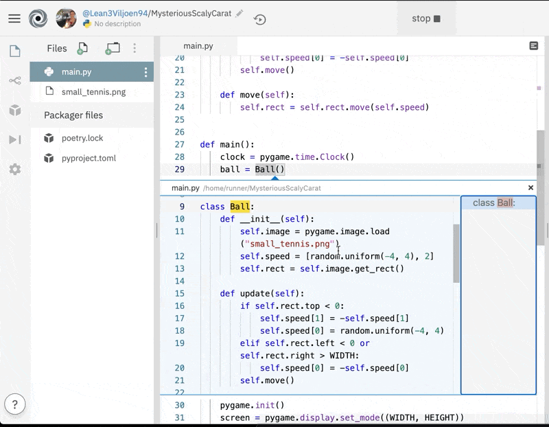

The **go to line** operation (`Ctrl+G`) allows you to navigate to a line by giving its line number. This is useful to track down the source of those error messages that tell you what line had an issue, or if you're on a call with someone who says "I'm looking at line 23" and you can quickly jump to the same place.

Finally, you can open a specific file by searching for a part of the name by pressing `Ctrl+P` (`cmd+P` on MacOS), which can be quicker than scrolling through the files pane if you have a lot of files.

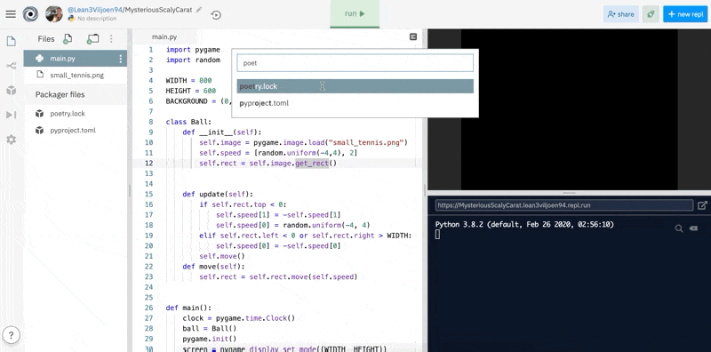

## Vim and Emacs key bindings

Once you get hooked on keyboard shortcuts, you might wonder if you ever need to use your mouse again. Most of the time it only slows you down. Luckily, people thought of this decades ago. Before mice existed, all text editing was done using only a keyboard, and many developers still prefer editors that were created in this setting over more modern ones.

The two main keyboard-focused text editors are called [Vim](https://www.vim.org/) and [Emacs](https://www.gnu.org/software/emacs/). They both have steep learning curves (and there's a long-standing tradition that users of either fiercely argue about which is superior), but once you've put in the time to master them you can get rid of your mouse for good.

If you've gotten used to either, you can emulate the experience in Repl.it by switching your keybinds. Go to the "Settings" tab and scroll down to where you can toggle between "default", "emacs" and "vim".

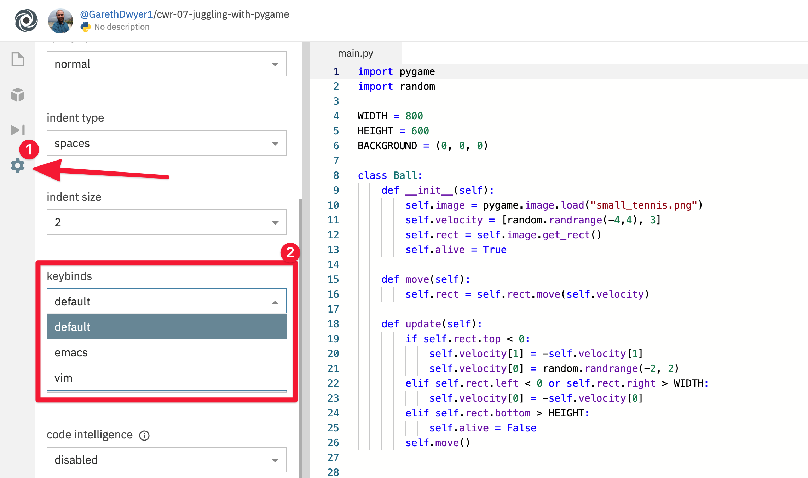

## Make it your own

If you want to keep hacking on the PyGame project using your new keyboard prowess, you can continue from where we left off below.

<iframe height="400px" width="100%" src="https://repl.it/@GarethDwyer1/cwr-10-productivity?lite=true" scrolling="no" frameborder="no" allowtransparency="true" allowfullscreen="true" sandbox="allow-forms allow-pointer-lock allow-popups allow-same-origin allow-scripts allow-modals"></iframe>

## Where next?

Now that you have mastered the productivity features of Repl.it, you can build proof of concept applications in no time.

In the next tutorial, we'll show you how to store data directly in the Repl.it key-value store, one of the simplest verieties of database. This will cover the so-called "CRUD" (Create, Read, Update, Delete) operations that are fundamental to any database-backed software.
