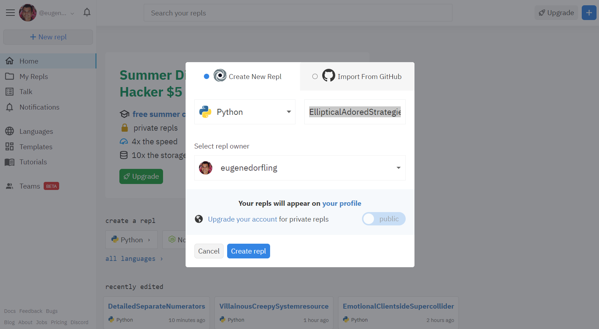
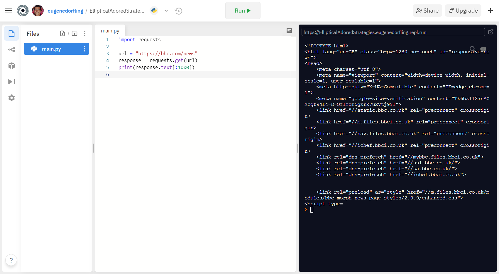
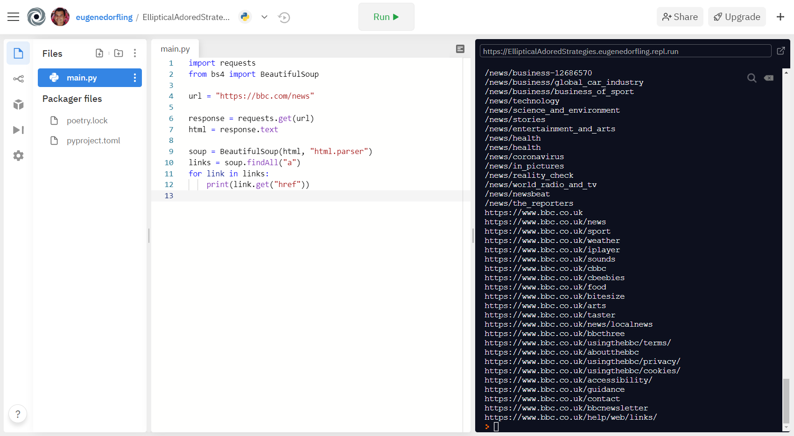
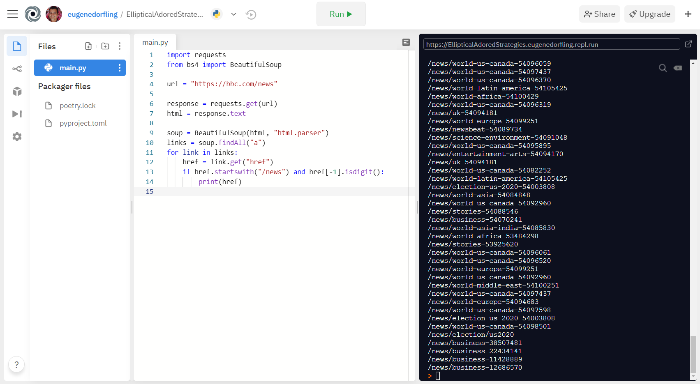
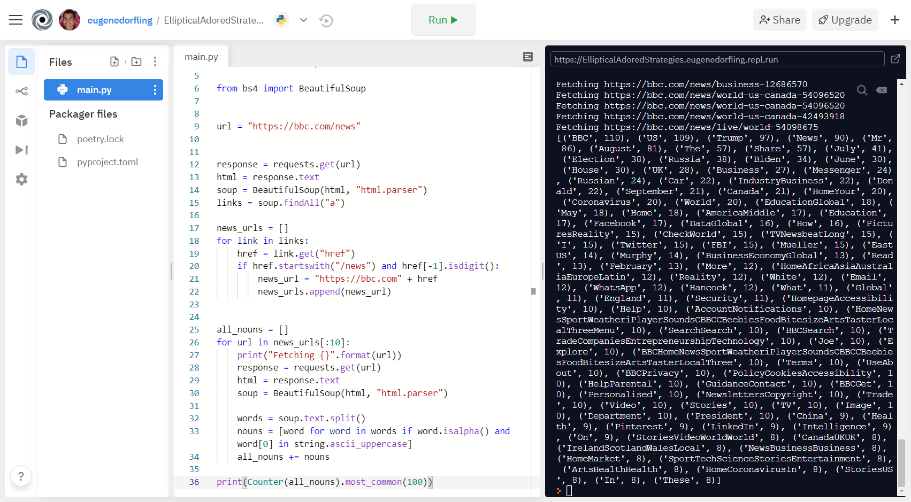

# Beginner web scraping with Python and Repl.it

In this guide, we'll walk through how to grab data from web sites automatically. Most websites are created with a *human* audience in mind - you use a search engine or type a URL into your web browser, and see information displayed on the page. Sometimes, we might want to *automatically* extract and process this data, and this is where web scraping can save us from boring repetitive labour. We can create a custom computer program to visit web sites, extract specific data and process this data in a particular way.

We'll be extracting news data from the [bbc.com](https://bbc.com/news) news website, but you should be able to adapt it to extract information from any website that you want with a bit of trial and error.

There are many reasons you might wish to use web scraping. For example, you might need to:

* extract numbers from a report that is released weekly and published online
* grab the schedule for your favourite sports team as it's released
* find the release dates for upcoming movies in your favourite genre
* be notified automatically when a website changes

There are many other use cases for web scraping. However, you should also note that copyright law and web scraping laws are complex and differ by country. As long as you aren't blatantly copying their content or doing web scraping for commercial gain, people generally don't mind web scaping. However, there have been some legal cases involving [scraping data from LinkedIn](https://techcrunch.com/2016/08/15/linkedin-sues-scrapers/) and media attention from [scraping data from OKCupid](https://www.engadget.com/2016/05/13/scientists-release-personal-data-for-70-000-okcupid-profiles/). Web scraping can violate the law, go against a particular website's terms of service, or breach ethical guidelines - so take care with where you apply this skill.

With the disclaimer out of the way, let's learn how to scrape!

## Overview and requirements
Specifically, in this tutorial we'll cover:

* What a website really is and how HTML works
* Viewing HTML in your web browser
* Using Python to download web pages
* Using [BeautifulSoup](https://www.crummy.com/software/BeautifulSoup/) to extract parts of scraped data


We'll be using the online programming environment [Repl.it](https://repl.it) so you won't need to install any software locally to follow along step by step. If you want to adapt this guide to your own needs, you should create a free account by going to [repl.it](https://repl.it) and follow their sign up process.

It would help if you have basic familiarity with Python or another high-level programming language, but we'll be explaining each line of code we write in detail so you should be able to keep up, or at least replicate the result, even if you don't.


## Webpages: beauty and the beast

You have no doubt visited web pages using a web browser before. Websites exist in two forms:

1. The one you are used to, where you can see text, images, and other media. Different fonts, sizes, and colours are used to display information in a useful and (usually) aesthetic way.
2. The "source" of the webpage. This is the computer code that tells your web browser (e.g. Mozilla Firefox or Google Chrome) what to display and how to display it.

Websites are created through a combination of three computer languages: HTML, CSS and JavaScript. This in itself is a huge and complicated field with a messy history, but having a basic understanding of how some of it works is necessary to automate web scraping effectively. If you open any website in your browser and right-click somewhere on the page, you'll see a menu which should include an option to "view page source" -- to inspect the code form of a website, before your web browser interprets it.

This is shown in the image below: a normal web page on the left, with an open menu (displayed by right-clicking on the page). Clicking "view page source" on this menu produces the result on the right -- we can see the code that contains all the data and supporting information that the web browser needs to display the complete page. While the page on the left is easy to read, use, and looks good, the one on the right is a monstrosity. It takes some effort and experience to make any sense of it, but it's possible and necessary if we want to write custom web scrapers.


### Navigating the source code using Find

The first thing to do is to work out how the two pages correspond: which parts of the normally displayed website match up to which parts of the code. You can use "find" Ctrl + F) in the source code view to find specific pieces of text that are visible in the normal view to help with this. In the web page on the left, we can see that the story starts with the phrase "Getting a TV job". If we search for this phrase in the code view, we can find the corresponding text within the code, on line 805.


The `<p class="story-body__introduction">` just before the highlighted section is HTML code to specify that a paragraph (`<p>` in HTML) starts here and that this is a special kind of paragraph (an introduction to the story). The paragraph continues until the `</p>` symbol. You don't need to worry about understanding HTML completely, but you should be aware that it contains **both** the text data that makes up the news article and additional data about how to display it. 

A large part of web scraping is viewing pages like this to a) identify the data that we are interested in and b) to separate this from the markup and other code that it is mixed with. Even before we start writing our own code, it can still be tricky first to understand other people's.

In most pages, there is a lot of code to define the structure, layout, interactivity, and other functionality of a web page, and relatively little that contains the actual text and images that we usually view. For especially complex pages it can be quite difficult, even with the help of the find function, to locate the code that is responsible for a particular part of the page. For this reason, most web browsers come with so-called "developer tools", which are aimed primarily at programmers to assist in the creation and maintenance of web sites, though these tools are also handy for doing web scraping.

### Navigating the source code using developer tools

You can open the developer tools for your browser from the main menu, with Google Chrome shown on the left and Mozilla Firefox on the right below. If you're using a different web browser, you should be able to find a similar setting.


Activating the tool brings up a new panel in your web browser, usually at the bottom or on the right-hand side. The tool contains an "Inspector" panel and a selector tool, which can be chosen by pressing the icon highlighted in red below. Once the selector tool is active, you can click on parts of the web page to view the corresponding source code. In the image below, we selected the same first paragraph in the normal view and we can see the `<p class=story-body__introduction">` code again in the panel below.


The Developer Tools are significantly more powerful than using the simple find tool, but they are also more complicated. You should choose a method based on your experience and the complexity of the page that you are trying to analyze.

## Downloading a web page with Python
Now that we've seen a bit more of how web pages are built in our browser, we can start retrieving and manipulating them using Python. Since Python is not a web browser, we'll only be able to retrieve and manipulate the HTML source code, rather than viewing the 'normal' representation of a web page.

We'll do this through a Python Repl using the `requests` library. Open [repl.it](https://repl.it) and choose to create a new Python Repl.



This will take you to a working Python coding environment where you can write and run Python code. To start with, we'll download the content from the BBC News homepage, and print out the first 1000 characters of HTML source code.

You can do this with the following four lines of Python:

```python
import requests

url = "https://bbc.com/news"
response = requests.get(url)
print(response.text[:1000])
```

Put this code in the `main.py` file that Repl automatically creates for you and press the "Run" button. After a short delay, you should see the output in the output pane - the beginning of HTML source code, similar to what we viewed in our web browser above.




Let's pull apart each of these lines.

* In line 1, we import the Python `requests` library, which is a library that allows us to make web requests.
* In line 3, we define a variable containing the URL of the main BBC news site. You can visit this URL in your web browser to see the BBC News home page.
* In line 4, we pass the URL we defined to the `requests.get` function, which will visit the web page that the URL points to and fetch the HTML source code. We load this into a new variable called `response`.
* In line 5, we access the `text` attribute of our `response` object, which contains all of the HTML source code. We take only the first 1000 characters of this, and pass them to the `print` function, which simply dumps the resulting text to our output pane.

We have now automatically retrieved a web page and we can display parts of the content. We are unlikely to be interested in the full source code dump of a web page (unless we are storing it for archival reasons), so let's extract some interesting parts of the page, instead of only the first 1000 characters.

## Using BeautifulSoup to extract all URLs
The world wide web is built from pages that link to each other using hyperlinks, links, or URLs. (These terms are all used more-or-less interchangeably).

Let's assume for now that we want to find all the news articles on the BBC News homepage, and get their URLs. If we look at the main page below, we'll see there are a bunch of stories on the home page. By mousing over any of the headlines with the "inspect" tool, we can see that each has a unique URL which takes us to that news story. For example, mousing over the main "US and Canada agree new trade deal" story in the image below is a link to https://www.bbc.com/news/business-45702609.

If we inspect that element using the browser's developer tools, we can see it is a `<a>` element, which is HTML for a link, with an `<href>` component that points to the URL. Note that the `href` section goes only to the last part of the URL, omitting the https://www.bbc.com part. Because we are already on BBC, the site can use *relative URLs* instead of *absolute URLs*. This means that when you click on the link, your browser will figure out that the URL isn't complete and prepend it with https://www.bbc.com. If you look around the source code of the main BBC page, you'll find both relative and absolute URLs, which already makes scraping all of the URLs on the page more difficult.


We could try to use Python's built-in text search functions like `find()` or regular expressions to extract all of the URLs from the BBC page, yet it is not actually possible to do this reliably. HTML is a complex language which allows web developers to do many unusual things. For an amusing take on why we should avoid a "naive" method of looking for links, see [this very famous](https://stackoverflow.com/questions/1732348/regex-match-open-tags-except-xhtml-self-contained-tags) StackOverflow question and the first answer.

Luckily, there is a powerful and simple-to-use HTML parsing library called [BeautifulSoup](https://www.crummy.com/software/BeautifulSoup/),  which will help us extract all the links from a given piece of HTML. We can use it by modifying the code in our Repl to look as follows.

```python
import requests
from bs4 import BeautifulSoup

url = "https://bbc.com/news"

response = requests.get(url)
html = response.text

soup = BeautifulSoup(html, "html.parser")
links = soup.findAll("a")
for link in links:
    print(link.get("href"))
```

If you run this code, you'll see that it outputs dozens of URLs, one per line. You'll probably notice that the code now takes quite a bit longer to run than before -- BeautifulSoup is not built into Python, it is a third-party module. This means that before running the code, Repl has to go and fetch this library and install it for you. Subsequent runs will be faster.



The code is similar to what we had before with a few additions.

* In line 2, we import the BeautifulSoup library, which is used for parsing and processing HTML.
* One line 9, we transform our HTML into "soup". This is BeautifulSoup's representation of a web page, which contains a bunch of useful programmatic features to search and modify the data in the page. We use the "html.parser" option to parse HTML which is included by default -- BeautifulSoup also allows you specify a custom HTML parser here. For example, you could install and specify a faster parser which can be useful if you need to process a lot of HTML data.
* In line 10, we find all the `a` elements in our HTML and extract them to a list. Remember, when we were looking at the URLs using our web browser (Image 7), we noted that the `<a>` element in HTML was used to define links, with the `href` attribute being used to specify where the link should go to. This line finds all of the HTML `<a>` elements.
* In line 11, we loop through all of the links we have, and in line 12 we print out the `href` section.

These last two lines show why BeautifulSoup is useful. To try and find and extract these elements without it would be remarkably difficult, but now we can do it in two lines of readable code!

If we look at the URLs in the output pane, we'll see quite a mixed bag of results. We have absolute URLs (starting with "http") and relative ones (starting with "/"). Most of them go to general pages rather than specific news articles. We need to find a pattern in the links we're interested in (that go to news articles) so that we can extract only those.

Again, trial and error is the best way to do this. If we go to the BBC News home page and use developer tools to inspect the links that go to news articles, we'll find that they all have a similar pattern. They are relative URLs which start with "/news" and end with a long number, e.g. `/news/newsbeat-45705989`

We can make a small change to our code to only output URLs that match this pattern. Replace the last two lines of our Python code with the following four lines:

```python
for link in links:
    href = link.get("href")
    if href.startswith("/news") and href[-1].isdigit():
        print(href)
```

Here we still loop through all of the links that BeautifulSoup found for us, but now we extract the `href` to its own variable immediately after. We then inspect this variable to make sure that it matches our conditions (starts with "/news" and ends with a digit), and only if it does, then we print it out.




## Fetching all of the articles from the homepage

Now that we have the link to every article on the BBC News homepage, we can fetch the data for each one of these individual articles. As a toy project, let's extract the proper nouns (people, places, etc) from each article and print out the most common ones to get a sense on what things are being talked about today.

Adapt your code to look as follows:


```python
import requests
import string

from collections import Counter

from bs4 import BeautifulSoup


url = "https://bbc.com/news"


response = requests.get(url)
html = response.text
soup = BeautifulSoup(html, "html.parser")
links = soup.findAll("a")

news_urls = []
for link in links:
    href = link.get("href")
    if href.startswith("/news") and href[-1].isdigit():
        news_url = "https://bbc.com" + href
        news_urls.append(news_url)


all_nouns = []
for url in news_urls[:10]:
    print("Fetching {}".format(url))
    response = requests.get(url)
    html = response.text
    soup = BeautifulSoup(html, "html.parser")

    words = soup.text.split()
    nouns = [word for word in words if word.isalpha() and word[0] in string.ascii_uppercase]
    all_nouns += nouns

print(Counter(all_nouns).most_common(100))
```

This code is quite a bit more complicated than what we previously wrote, so don't worry if you don't understand all of it. The main changes are:

* At the top, we add two new imports in addition to the `requests` library. The first new module is one for `string`, which is a standard Python module that contains some useful word and letter shortcuts. We'll use it to identify all the capital letters in our alphabet. The second module is a `Counter`, which is part of the built-in `collections` module. This will let us find the most common nouns in a list, once we have built a list of all the nouns.
* We've added `news_urls = []` at the top of the first `for` loop. Instead of printing out each URL once we've identified it as a "news URL", we add it to this list so we can download each page later. Inside the for loop two lines down, we combine the root domain ("http://bbc.com") with each href attribute and then add the complete URL to our `news_urls` list.
* We then go into another for loop, where we loop through the first 10 news URLs (if you have more time, you can remove the `[:10]` part to iterate through all the news pages, but for efficiency, we'll just demonstrate with the first 10).
* We print out the URL that we're fetching (as it takes a second or so to download each page, it's nice to display some feedback so we can see that the program is working).
* We then fetch the page and turn it into soup, as we did before.
* With `words = soup.text.split()` we extract all the text from the page and split this resulting big body of text into individual words. The Python `split()` function splits on white space, which is a crude way to extract words from a piece of text, but it will serve our purpose for now.
* The next line loops through all the words in that given article and keeps only the ones that are made up of numeric characters and which start with a capital letter (`string.ascii_uppercase` is just the uppercase alphabet). This is also an extremely crude way of extracting nouns, and we will get a lot of words (like those at the start of sentences) which are not actually proper nouns, but again it's a good enough approximation for now.
* We then add all the words that look like nouns to our `all_nouns` list and move on to the next article to do the same. 
* Finally, once we've downloaded all the pages, we print out the 100 most common nouns along with a count of how often they appeared using Python's convenient `Counter` object. 

You should see output similar to that in the image below (though your words will be different, as the news changes every few hours). We have the most common "nouns" followed by a count of how often that noun appeared in all 10 of the articles we looked at.

We can see that our crude extraction and parsing methods are far from perfect -- words like "Twitter" and "Facebook" appear in most articles because of the social media links at the bottom of each article, so their presence doesn't mean that Facebook and Twitter themselves are in the news today. Similarly, words like "From" aren't nouns, and other words like "BBC" and "Business" are also included because they appear on each page, outside of the main article text.



## Where next? 
We've completed the basics of web scraping and have looked at how the web works, how to extract information from web pages, and how to do some very basic text extraction. You will probably want to do something other than extract words from BBC! You can fork this Repl from https://repl.it/@GarethDwyer1/beginnerwebscraping and modify it to change which site it scrapes and what content it extracts. You can also join the [Repl Discord Server](https://discord.com/login?redirect_to=%2Fchannels%2F%40me) to chat with other developers who are working on similar projects and who will happily exchange ideas with you or help if you get stuck.

We have walked through a very flexible method of web scraping, but it's the "quick and dirty" way. If BBC updates their website and some of our assumptions (e.g. that news URLs will end with a number) break, our web scraper will also break.

Once you've done a bit of web scraping, you'll notice that the same patterns and problems come up again and again. Because of this, there are many frameworks and other tools that solve these common problems (finding all the URLs on the page, extracting text from the other code, dealing with changing web sites, etc), and for any big web scraping project, you'll definitely want to use these instead of starting from scratch.

Some of the best Python web scraping tools are:

* [**Scrapy**](https://scrapy.org/): A framework used by people who want to scrape millions or even billions of web pages. Scrapy lets you build "spiders" -- programmatic robots that move around the web at high speed, gathering data based on rules that you specify.
* [**Newspaper**](https://github.com/codelucas/newspaper): we touched on how it was difficult to separate the main text of an online news article from all the other content on the page (headers, footers, adverts, etc). This problem is an incredibly difficult one to solve. Newspaper uses a combination of manually specified rules and some clever algorithms to remove the "boilerplate" or non-core text from each article.
* [**Selenium**](https://www.seleniumhq.org/): we scraped some basic content without using a web browser, and this works fine for images and text. Many parts of the modern web are dynamic though -- e.g. they only load when you scroll down a page far enough or click on a button to reveal more content. These dynamic sites are challenging to scrape, but Selenium allows you to fire up a real web browser and control it just as a human would (but automatically), and this allows you to access this kind of dynamic content.

There is no shortage of other tools, and a lot can be done simply by using them in combination with each other. Web scraping is a vast world that we've only just touched on, but we'll explore some more web scraping use cases in the next chapter, in particular, building news word clouds.

